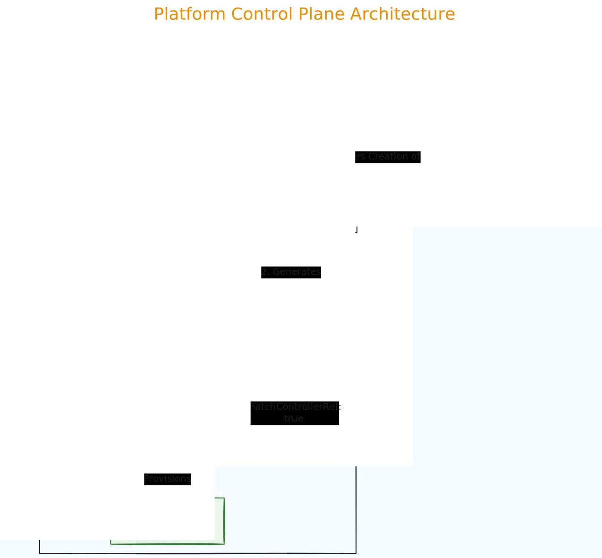

# 🛡️ AWS Self-Healing Platform (Crossplane)

This repository serves as the **Control Plane** for our Internal Developer Platform (IDP). It defines the custom infrastructure APIs that allow developers to self-service compliant AWS resources without managing low-level cloud complexity.

## 🏗️ Architecture
- **Infrastructure Provider:** Upbound AWS Provider (S3)
- **Logic Engine:** Crossplane Composition Functions (Patch & Transform)
- **API Group:** `yagnesh.cloud`

## 📂 Project Structure
```text
.
├── platform
│   ├── apis
│   │   └── secure-bucket-xrd.yaml        # API Definition (The Interface)
│   └── compositions
│       └── s3-secure-composition.yaml    # Infrastructure Logic (Bucket + Encryption)
├── function.yaml           # Installs the Logic Engine
├── provider.yaml           # Installs the AWS Provider
└── provider-config.yaml    # Configures AWS Credentials

```

## 🚀 How it Works

1. **Abstraction:** We define a simple API (`SecureBucket`) that only asks for a `region` and `tags`.
2. **Composition:** Crossplane automatically expands this request into:
* An **AWS S3 Bucket**
* An **AWS Server-Side Encryption Configuration** (linked via `matchControllerRef`)


3. **Policy Enforcement:** The platform enforces `AES256` encryption on every bucket, ensuring security compliance by default.

## 🛠️ Deployment (Platform Admin)

```bash
# 1. Install Provider & Functions
kubectl apply -f provider.yaml
kubectl apply -f function.yaml

# 2. Configure Credentials
kubectl apply -f provider-config.yaml

# 3. Apply the Platform Logic
kubectl apply -f platform/apis/secure-bucket-xrd.yaml
kubectl apply -f platform/compositions/s3-secure-composition.yaml
```
